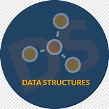

# Estructura de Datos Aplicadas

En este repositorio se encuentran los códigos de las **estructuras de datos** siguientes:

1. Recursividad.
1. Arreglos (_Vectores_ y _Matrices_).
1. Listas Enlazadas.
1. Pilas y Colas.
1. Arboles Binarios.

Realizado por Rafael Hernández Pérez.